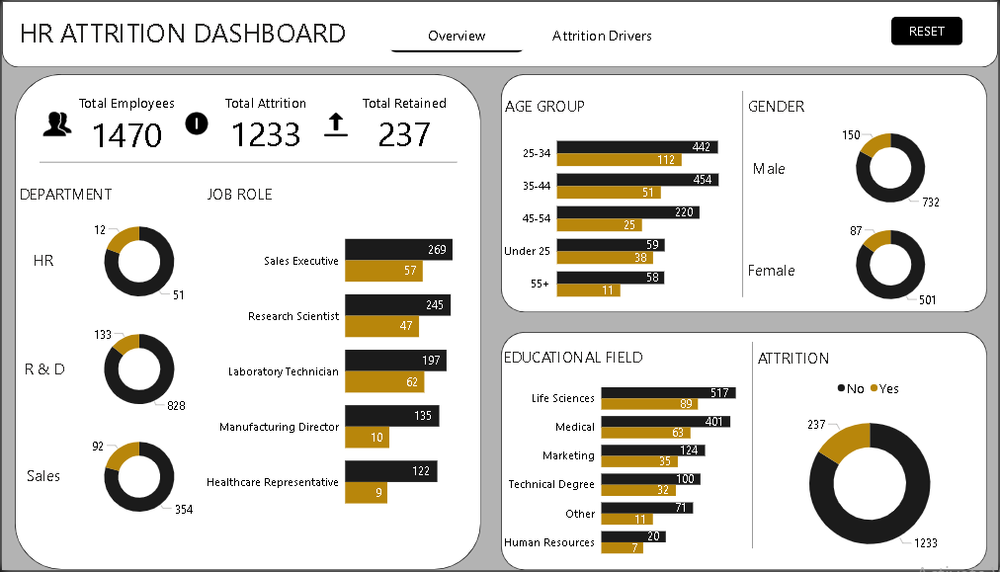
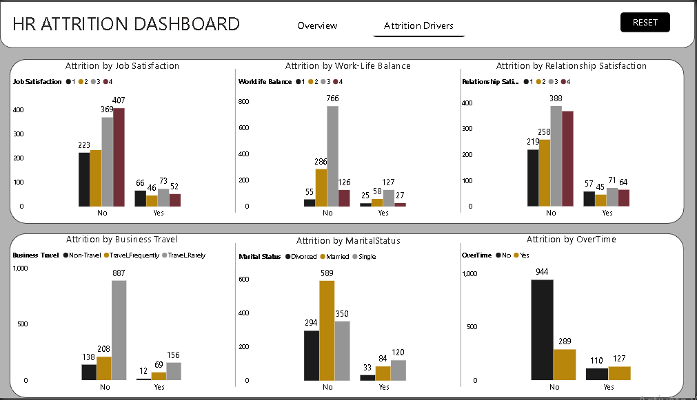

# HR Attrition Dashboard

## Overview
This Power BI dashboard analyzes employee attrition using the IBM HR Analytics dataset (1,470 employees). It breaks down who's leaving and why, covering department, job role, age, gender, and education on one page, then digging into drivers like overtime, business travel, marital status, job satisfaction, work-life balance, and relationship satisfaction on a second page.

## Dashboard Preview

## Files
- HR Attrition Dashboard.pbix
- [DATASET](WA_Fn-UseC_-HR-Employee-Attrition.csv)
- image/Overview.PNG, image/Attrition_Drivers.PNG

## Key Insights
* Total workforce: 1,470 employees, 237 attritions.
* R&D is the largest department at 961 employees (65% of the workforce) and has the lowest departmental attrition rate.
* Sales has the highest departmental attrition rate (92 of 446), followed by HR (12 of 63).
* Laboratory Technicians have the highest attrition rate of any job role (62 of 259).
* Manufacturing Directors and Healthcare Representatives tie for the lowest job-role attrition rate.
* Sales Executives leave at (57 of 326), close to the company average.
* Research Scientists leave at (47 of 292), almost exactly matching the company-wide rate.
* Employees under 25 leave at (38 of 97), more than double the rate of any other age group.
* Attrition dips through the middle years  then climbs back for employees 55+.
* Male employees make up 60% of the workforce (882 of 1,470) and leave slightly more often than female employees.
* Life Sciences is the largest educational background (606 employees, 41% of the workforce) with a below-average attrition rate.
* Human Resources graduates have the highest attrition rate by educational field (7 of 27), though it's the smallest group.
* Technical Degree holders leave at (32 of 132), the second-highest educational field.
* Medical and "Other" educational fields are the most stable.
* OverTime is the single strongest driver in the dataset: (127 of 416) for employees working overtime, versus (110 of 1,054) for those who don't.
* Frequent travelers leave at (69 of 277), more than triple the rate of employees who don't travel for work (12 of 150). Rare travelers sit in between (156 of 1,043).
* Single employees leave at (120 of 470), roughly double the rate of married employees (84 of 673) and more than double divorced employees (33 of 327).
* Employees with "Bad" work-life balance leave at (25 of 80), the highest of any level, more than double the rate of those rating it "Better" (127 of 893).
* Work-life balance level 3  holds the largest share of employees (893, 61% of the workforce) and one of the lowest attrition rates.
* Job satisfaction shows a clear downward slope: attrition at the lowest satisfaction level versus the highest, roughly double from bottom to top.
* Relationship satisfaction shows the same direction but a smaller gap: attrition at the lowest level versus across levels 2 through 4.
* Married employees are the largest marital group (673, 46% of the workforce) and sit at a moderate attrition rate, in between divorced and single employees.
